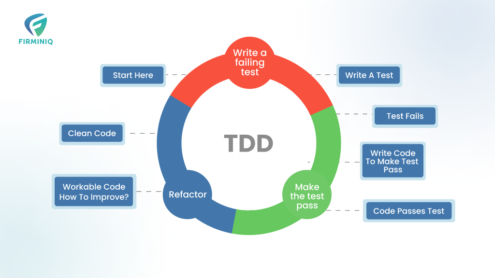

<p align="center">
  
</p>

Here are the general steps to follow when using Test-Driven Development (TDD) in Python:

### 1. **Understand the Requirement**
   - Clearly understand what functionality or feature you're going to implement. Define the expected behavior or output.

### 2. **Write a Test First (Red Phase)**
   - Start by writing a unit test that defines a function or method you haven't implemented yet. The test should reflect the requirements.
   - Use a testing framework like `unittest` or `pytest` to write the test.
   - Example with `pytest`:
     ```python
     def test_add():
         assert add(2, 3) == 5
     ```

### 3. **Run the Test and See it Fail**
   - Run the test to confirm that it fails, as the function does not yet exist or has not been implemented. This step ensures that the test is valid.
   - In `pytest`, you can run the test with:
     ```bash
     pytest
     ```

### 4. **Write the Minimal Code to Pass the Test (Green Phase)**
   - Implement just enough code to make the test pass. The focus here is on simplicity and correctness.
   - Example:
     ```python
     def add(a, b):
         return a + b
     ```

### 5. **Run the Tests Again**
   - Execute all tests to verify that the new code passes the test. If it does, you’ve confirmed that the functionality works as intended.
   - In `pytest`:
     ```bash
     pytest
     ```

### 6. **Refactor the Code (Refactor Phase)**
   - Improve the code structure while keeping the functionality the same. Clean up duplications, improve readability, and follow coding best practices.
   - Make sure to rerun the tests after refactoring to ensure nothing breaks.

### 7. **Repeat**
   - Continue the cycle: write another failing test, implement just enough to pass, and then refactor.

By following these steps in TDD, you will incrementally develop your code while ensuring that it is well-tested and reliable.


# Example

Here's an example of using TDD to build and test a Python pipeline that retrieves data from several APIs. We'll use the `unittest` framework along with `unittest.mock` to mock the API calls.

### Scenario:
Imagine we have a pipeline that fetches data from two different APIs, processes it, and returns the combined results.

### Step 1: Write a Failing Test

We'll start by writing a test for a pipeline that retrieves data from two APIs. We'll mock the API responses, as we don't want to make real requests in the test environment.

```python
import unittest
from unittest.mock import patch

# Assuming the pipeline function we want to test is called 'fetch_data_pipeline'
class TestFetchDataPipeline(unittest.TestCase):

    @patch('pipeline.requests.get')
    def test_fetch_data_pipeline(self, mock_get):
        # Mock API responses
        mock_get.side_effect = [
            # First API response
            unittest.mock.Mock(status_code=200, json=lambda: {"data": "API 1 data"}),
            # Second API response
            unittest.mock.Mock(status_code=200, json=lambda: {"data": "API 2 data"})
        ]

        # Import the pipeline function
        from pipeline import fetch_data_pipeline

        # Call the function and check the result
        result = fetch_data_pipeline()
        expected_result = {
            "api_1": "API 1 data",
            "api_2": "API 2 data"
        }
        self.assertEqual(result, expected_result)

if __name__ == '__main__':
    unittest.main()
```

### Step 2: Run the Test

At this point, running the test will fail because the `fetch_data_pipeline` function doesn't exist yet.

```bash
python -m unittest test_pipeline.py
```

### Step 3: Write Minimal Code to Pass the Test

Now, we will create the `fetch_data_pipeline` function that fetches data from the APIs. We'll use `requests` for making HTTP calls.

```python
import requests

def fetch_data_pipeline():
    api_1_response = requests.get('https://api1.example.com/data')
    api_2_response = requests.get('https://api2.example.com/data')

    return {
        "api_1": api_1_response.json().get("data"),
        "api_2": api_2_response.json().get("data")
    }
```

### Step 4: Run the Tests Again

Now, when you run the tests, they should pass.

```bash
python -m unittest test_pipeline.py
```

### Step 5: Refactor (if necessary)

Once the test passes, you can refactor the code to improve readability or efficiency. For example, you could handle errors from the APIs or make the function more flexible. But for now, our code is simple and works fine.

---

### Complete Example

#### Pipeline Code (`pipeline.py`):
```python
import requests

def fetch_data_pipeline():
    api_1_response = requests.get('https://api1.example.com/data')
    api_2_response = requests.get('https://api2.example.com/data')

    return {
        "api_1": api_1_response.json().get("data"),
        "api_2": api_2_response.json().get("data")
    }
```

#### Test Code (`test_pipeline.py`):
```python
import unittest
from unittest.mock import patch

class TestFetchDataPipeline(unittest.TestCase):

    @patch('pipeline.requests.get')
    def test_fetch_data_pipeline(self, mock_get):
        # Mock API responses
        mock_get.side_effect = [
            unittest.mock.Mock(status_code=200, json=lambda: {"data": "API 1 data"}),
            unittest.mock.Mock(status_code=200, json=lambda: {"data": "API 2 data"})
        ]

        from pipeline import fetch_data_pipeline

        result = fetch_data_pipeline()
        expected_result = {
            "api_1": "API 1 data",
            "api_2": "API 2 data"
        }
        self.assertEqual(result, expected_result)

if __name__ == '__main__':
    unittest.main()
```

### Explanation:
- **Mocking API calls**: The `@patch('pipeline.requests.get')` decorator replaces `requests.get` with a mock object, so we don't actually hit real APIs.
- **Mock responses**: We use `side_effect` to simulate two different API responses. The first call returns data from "API 1", and the second call returns data from "API 2".
- **Assertions**: We check if the function returns the expected combined data from both APIs.

This approach ensures that the tests run quickly and independently of external services.